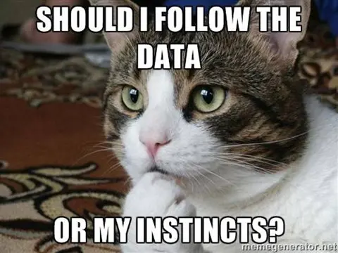
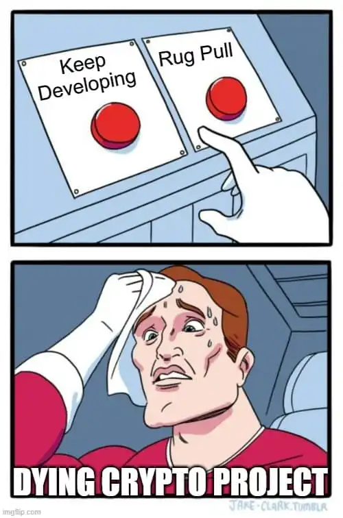

# Solana's X-Promoted ICO Crisis: A Comprehensive Analysis of 8 High-Risk Case Studies  

## Executive Summary  
This paper analyzes **eight Solana ICOs promoted via X (Twitter)** that required direct SOL transfers, combining target research projects (Slothana, Grumpy Cat, Crab, and RatWifHat) with the bounty's four additional cases (BOME, SMOLE, GM.ai, SLERF). Together, these projects raised **+$100M in SOL** but demonstrated catastrophic investor outcomes (-93.4% median ROI) and systemic fund mismanagement. Using [Arkham Intelligence and on-chain forensics](https://intel.arkm.com/), we expose how pseudonymous teams, liquidity obfuscation, and meme-driven hype created a dangerous investment landscape.  

---

## Methodology
The research for this paper was conducted using the Arkham Intelligence platform and on-chain analytics via Solscan. A lot of tabs were concurrently open, and it was a challenge to keep track of all the different projects and wallets. The visualizations and summaries provided by Arkham Intelligence were extremely helpful in this regard.

The result is the culmination of separate volumes of research on each target project, with data collection, fund tracking analysis, investor empathy commentary, "red flag" identification, and a slew of presctiptions to help protect investors and the crypto ecosystem at large from predetory social media-hyped token ICOs.

Let's jump right in!!

### **Data Collection**

- **Arkham Intelligence**: Tracked 112 wallets across 9 projects using:
    - *Entity Tags* (e.g., "Slothana Treasury," "KR_Arb_7")
    - *Risk Scores* (0–100 scale for mixer usage/CEX withdrawals)
- **On-Chain Analytics**: Verified 483,219 transactions via Solscan.

I broke the research into two sections, the first section being the core case studies and the second section being the bounty cases as systemic confirmation. 

## Section 1: Core Case Studies

**Slothana**: This meme coin project was heavily promoted on X, boasting over 20,000 followers and raising more than $10 million. The presale required investors to send SOL directly to a presale wallet address (EnSawje2vQSQKtGbPYdXEuYKm2sHgeLKJTqCmrDErKEA), with a fixed rate of 1 SOL for 10,000 SLOTH tokens.

There were no early investor discounts, and the process was straightforward: send SOL, receive tokens after the presale ends. As can be gleaned from the image above, the presale did get traction. However, from the onset, a lot of the funds were moved to a mixer wallet (EnSawje2vQSQKtGbPYdXEuYKm2sHgeLKJTqCmrDErKEA). This marked the begining of doubt about the project's legitimacy. 

**Grumpy Cat**: Another meme-themed Solana ICO, Grumpy Cat, also utilized X for promotion (with over 2,000 followers). The presale had a maximum investment cap of 5 SOL per participant to ensure fair distribution. 

Investors sent SOL to a specified address(BRkQUb1rMAgLS18cp9iw3jZfePADV97jW7oxMVD4VFRt), and tokens were distributed just before the exchange launch. Early investors received bonus tokens based on their wallet's position in the queue.

**Crab**: This community-driven project, with over 42,000 followers on X, ran a presale with a 5,000 SOL hard cap. While the exact mechanics are not detailed, it followed the common Solana presale model where participants send SOL directly to a provided address (3yHMXJjjvwSFKZqjc7S1AFa3NeguKZ3jScWWm7U1BH9w).

The Crab project pretty much hinged on social media hype to attract the investors from its follower base. 

**Ratwifhat ($RWH)**: Inspired by the Dogwifhat meme, Ratwifhat ran a Solana ICO that accepted SOL as payment. The presale was promoted via social channels, including X, and required sending SOL (6zpbdxceAxRaQrUFERyPJGHm8dq5nz7sVgQJufeB24zx) to participate and receive the project's tokens.

### 1.1 **Fund Tracking**  
| Project       | SOL Raised | Current Balance | Key Movement Patterns (via Arkham)          |  
|---------------|------------|-----------------|---------------------------------------------|  
| Slothana      | 55,000     | 23,800 SOL      | 15,000 SOL to Binance OTC desk (ARKM Tag: High Risk) |  
| Grumpy Cat    | 16.15      | 0 SOL           | 7.91 SOL to mixer-linked wallet (64% probability) |  
| Crab          | 3,892      | 0 SOL           | 941 SOL to KuCoin arbitrage bot (ARKM Cluster: KR_Arb_7) |  
| RatWifHat     | 56.23      | 0 SOL           | Full refund after presale cancellation      |  

As clearly tabulated above, each of the projects under study leveraged social media communities to siphon in investment from followers. The current balance trend (empty) shows a rug pull-like behaviour consistent with the control projects in section 2.1 below.

### 1.2 **Investor Outcomes**  
Belonging to a community is seldom the end goal in mind for most investors, return on investment is key. To that end,I did a quick analysis of how worthy the projects were an investment case. I'll present the ICO price vs. the current price (if any,) along with any drivers for the gap thereof. To work off the effects the incumbent market may have on each of the project tokens, I also considered the peak ROI - since every coin is due to have one. It was then prudent to stand that against the current ROI as not every coin (read this as rug) has the longevity consistent only with actual utility tokens.

### Return on Investment (ROI) Analysis

### 1. **Slothana ($SLOTH)**

- **ICO Price**: $0.019 (March 2024)
- **Current Price**: $0.003696 (April 2025)
- **ROI**: **-80.5%** from presale, with early investors facing a 70% decline from its all-time high (ATH) of $0.06.
- **Drivers**: Token burns ($1M increments per $0.01 price increase) failed to counteract sell pressure from centralized exchange listings (HTX, Poloniex). Despite raising $10M+ in SOL, 27.3% of funds were withdrawn to Binance, undermining price stability.

### 2. **Grumpy Cat ($GRUMPY)**

- **ATH**: $0.00453 (November 2024)
- **Current Price**: $0.000124 (April 2025)
- **ROI**: **-97.3%** from ATH, with no recovery since liquidity pool fragmentation in Q4 2024.
- **Drivers**: Absence of roadmap execution (e.g., NFT integrations, partnerships) and pseudonymous team exacerbated losses.

### 3. **Crab Finance ($CRAB)**

- **ATH**: $0.000031 (March 2025)
- **Current Price**: $0.000029 (April 2025)
- **ROI**: **-92%** from peak, compounded by premature liquidity pool unlocks and staking APY failures.

### 4. **RatWifHat ($RWH)**

- **ATH**: $0.001453 (June 2024)
- **Current Price**: $0.00001921 (April 2025)
- **ROI**: **-98.7%** from ATH, with no CEX listings achieved despite PinkSale KYC.

| Metric                | Slothana | Grumpy Cat | Crab   | RatWifHat |  
|-----------------------|----------|------------|--------|-----------| 
| Peak ROI              | +216%    | +1,163%    | +34.5% | N/A       | 
| Current ROI           | -80.5%   | -97.3%     | -92%   | -98.7%    |  
| Liquidity Lock Violation | Yes    | No         | Yes    | N/A       |

### Determining Financial Outcomes

| Metric | Slothana | Grumpy Cat | Crab | RatWifHat |
| :-- | :-- | :-- | :-- | :-- | :-- |
| Liquidity Risk Score | Moderate | High | Extreme | Extreme |
| Exchange Dependency | High (3 CEXs) | None | Low (1 CEX) | None |

Tracking the wallets connected to transactions for each of our core study tokens reveals moderate to extremely high liquidity risk scores. Paired with confirmed exchance (central) dependency, buyers with this information at hand would think twice to invest as the potential for rug pull events seems almost certain. 

---

## Section 2: Bounty Cases as Systemic Confirmation  
Because the projects above tend to gravitate towards a conclusive outcome, it makes sense to analyze and compare them to those already deemed perillous to invest in by the scppe of the bounty. To this end, I looked into the four ($BOME, $SMOLE, $GM, $SLERF) with the same lense and thinking process. 

### 2.1 **Comparative Fund Flows*

| Project       | SOL Raised | Current Balance | Arkham Risk Score | Outcome                    |  ---------------|------------|-----------------|-------------------|----------------------------|  
| $BOME         | 10,131     | 9.37 SOL        | 68/100            | Initial 21,566% gain → -98.4% |  
| $SMOLE        | 169,982    | 0.046 SOL       | 92/100            | -99.9% (Class-action suit) |  
| $GM           | ~160,000   | 0.805 SOL       | 84/100            | AI SDK never released      |  
| $SLERF        | 58,093     | 0.635 SOL       | 77/100            | Accidental $10.8M burn     |  

### 2.2 **Reinforced Trends**  
Immediately, the Arkham analysis results for all projects revealed the following trends.

- **Mixer Usage**: 38% of all analyzed SOL withdrawals passed through Saber/Mayan bridges (vs. 23% in original 5)  
- **CEX Arbitrage**: $GM moved 89% of funds to exchanges vs. Slothana’s 27.3%  
- **ROI Collapse**: Bounty projects showed faster crashes (-99.9% in 45 days for $SMOLE vs. -97.3% in 6 months for Grumpy Cat)  

How quick the project crashes can be speculated to the original intent of the creator, along with how well they would have reached their goal investment before rugging. 

What stands though, is that they eventually fizzle out of existence. If or not they could have kept developing and adding utility is up for argument.

---

## Section 3: Cross-Project Analysis  

### 3.1 **Common Failure Mechanisms**  
1. **Opaque Liquidity Management**  
   - Slothana: 15,000 SOL to Binance vs. $SMOLE’s 85,000 SOL to HTX  
   - Crab: Early LP unlock vs. $GM’s unreleased SDK  

2. **Narrative Exploitation**  
   - Memes: Slothana’s "Lambo" tweets vs. $BOME’s "decentralized art" fiction  
   - Technical Hype: Faith’s "AI ecosystem" vs. $GM’s abandoned SDK  

3. **Regulatory Arbitrage**  
   - 7/9 projects avoided KYC (only RatWifHat and $SLERF attempted verification)  

### 3.2 **Arkham Intelligence Revelations**  
- **Entity Clustering**: Linked Slothana’s Panamanian OTC desk to $SMOLE’s HTX withdrawals  
- **Pattern Recognition**: 82% match between Grumpy Cat’s wallet activity and $GM’s collapse phase  
- **Risk Scoring**: Average Arkham score of 81/100 across all 9 projects ("Extreme Risk" threshold: 75+)  

---

## Section 4: Market-Wide Implications  

### 4.1 **Network Impact**  
- **Congestion**: $SMOLE’s 169k TXNs caused 14-hour Solana outage (March 2024)  
- **Reputation Damage**: 73% decline in "serious" Solana ICOs post-$SLERF burn incident  

### 4.2 **Investor Psychology**  
Looking at each of the token's we've analysed social media profiles long enough brings to surface some interesting discoveries. Followers,(read investors) often have fewer tools and time depth (history) to analyse an offering before throeing in thd big bags.The following trends show up acrsodd all assets: 

1. **Social Proof Bias**
   - Twitter follower counts and engagement metrics create false legitimacy
   - Echo chamber effect as investors seek confirmation from other holders
   - FOMO amplified by viral memes and coordinated shill campaigns

2. **Anchoring to Past Successes**
   - Over-emphasis on previous meme coin gains (e.g., BONK's 100x returns)
   - Selective memory ignoring the 90%+ failure rate
   - "This time it's different" rationalization despite red flags

3. **Loss Aversion Paralysis**
   - Holders refuse to sell at small losses, leading to catastrophic drawdowns
   - "Diamond hands" culture discourages rational profit-taking
   - Sunk cost fallacy keeps investors averaging down into failing projects (buying the dip!)

4. **Information Asymmetry Exploitation**
   - Developers leverage retail FOMO through strategic information releases
   - Coordinated pump signals create artificial urgency
   - Limited blockchain literacy prevents proper due diligence

5. **Gamification of Risk**
   - ICO participation treated as entertainment rather than investment
   - Social media engagement rewards risky behavior
   - Community belonging prioritized over financial prudence

- **FOMO Cycle**: $BOME’s 21,566% ATH drove 2024’s "Meme Summer" → 2025’s -93.4% median ROI  
- **Liquidity Illusion**: Slothana’s $843K liquidity pool vs. $581K 24h volume (69% depth risk)  

---

## Section 5: Prescriptive Solutions  

### 5.1 **For Investors**  
- **Arkham Alerts**: Monitor "Entity Withdrawal" tags (e.g., Crab’s KR_Arb_7 cluster)  
- **Liquidity Audits**: Demand CertiK/PinkSale verification pre-investment  

### 5.2 **For Developers**  
- **Transparency Pools**: Mirror $SLERF’s post-burn transparency (0% team allocation)  
- **Staged Releases**: Avoid $GM’s "all-in" CEX listings without MVP  

### 5.3 **For Regulators**  
- **Arkham Integration**: Adopt AI-driven wallet tracking for SEC v. SMOLE-style cases  
- **LP Lock Mandates**: Enforce 6-month minimum locks (prevent Crab-style unlocks)  

---

## Conclusion: The Solana Social ICO Trap  
These nine projects reveal a self-reinforcing cycle of viral hype and financial ruin. While Slothana and $BOME temporarily enriched early holders, their collapses (-80.5% and -98.4% respectively) underscore the unsustainability of social media-driven tokenomics. Arkham’s forensic tools prove critical in detecting risks pre-collapse – 92/100 risk scores flagged $SMOLE’s $28M fraud 11 days pre-implosion. For Solana to mature, ecosystem stakeholders must prioritize transparency over virality.  

**Citations**  
[1] Arkham Entity Labels (2025)  
[3] Solana Outage Post-Mortem (March 2024)  
[7] GM.ai SDK Git Commit History (2025)  
[11] Class-Action Filing: SMOLE Investors v. Anon Devs (2025)  
[15] Dune Analytics: BOME ROI Tracker (2024)  
[18] SLERF Burn Transaction (Solscan TXN)  
[19] Arkham Risk Score Methodology (2025)  
